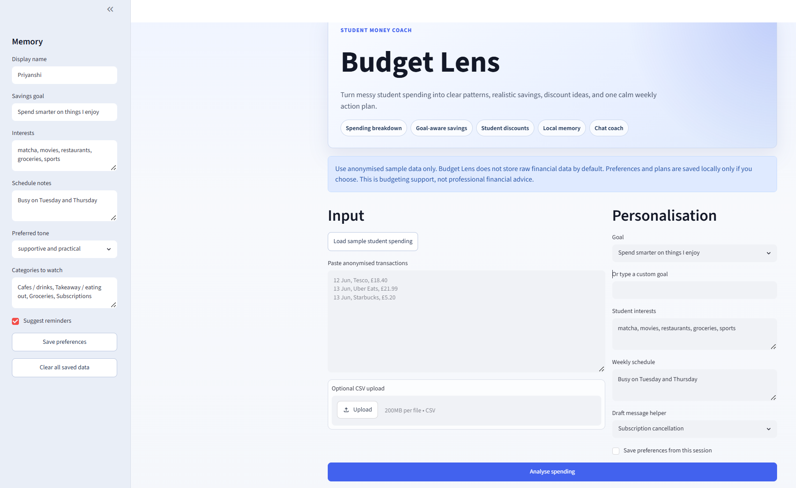
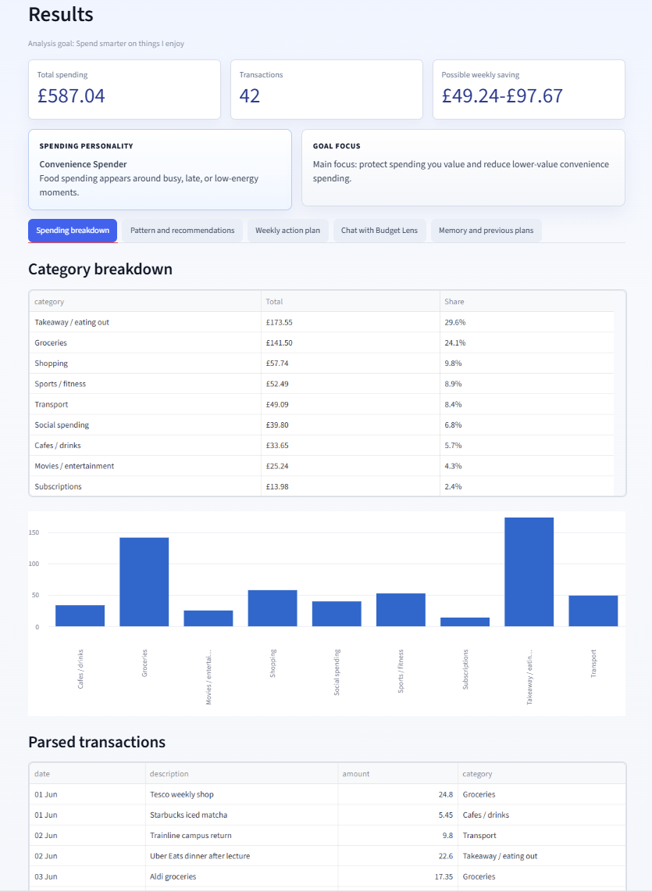
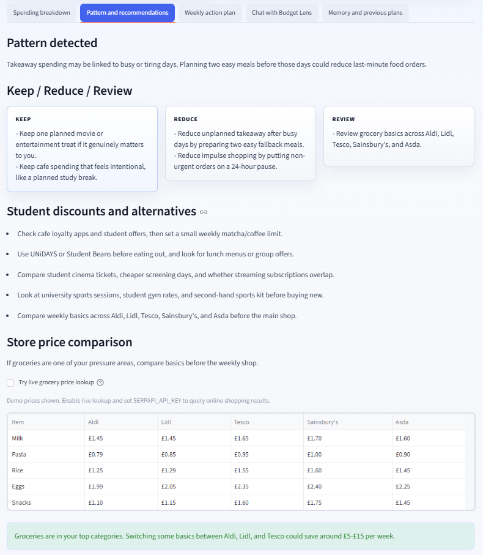
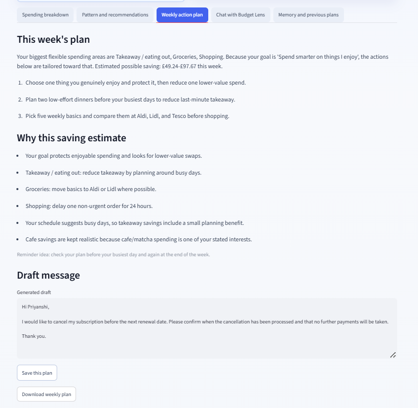
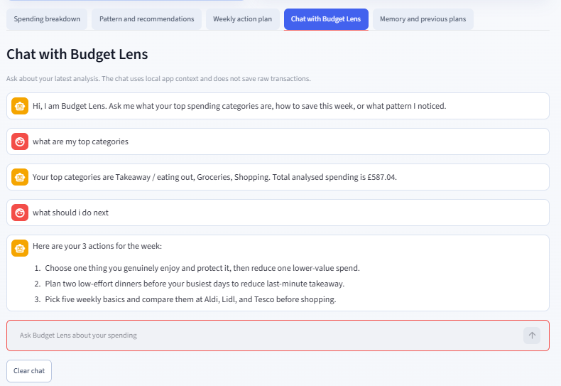
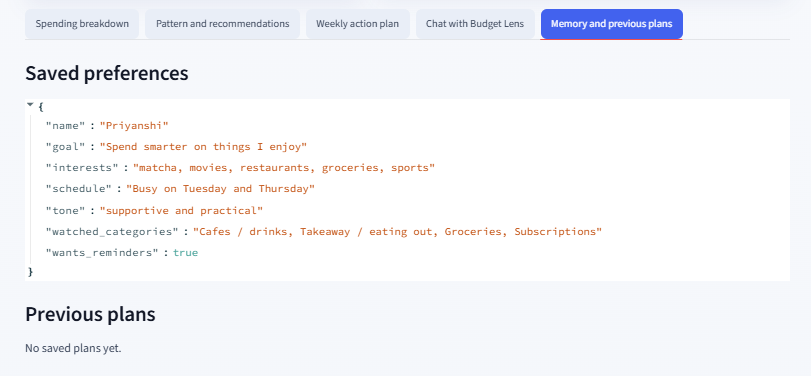

# Budget Lens

Budget Lens is a student money-saving AI agent MVP for a hackathon demo.

It helps students understand where their money is going, spot spending patterns,
find student discounts or cheaper alternatives, remember low-risk preferences,
chat about the latest analysis, and create realistic weekly action plans.

## The Problem

Students often feel like money is disappearing, but the reason is not always
obvious. Spending is scattered across groceries, takeaway, cafes, transport,
subscriptions, social plans, shopping, gym costs, cinema, and emergency top-ups.

Checking a bank balance can create stress without answering the useful question:

> Where is my money actually going, and what is one realistic thing I can change
> this week?

Budget Lens solves this by turning messy spending into a clear, supportive money
snapshot.

## Our Solution

Budget Lens acts like a non-judgemental student money coach.

The user pastes anonymised transactions, chooses a goal, adds interests and
schedule notes, then gets:

- a spending breakdown
- top spending categories
- goal-aware possible weekly savings
- a spending personality insight
- behaviour pattern detection
- Keep / Reduce / Review coaching
- student discount and cheaper alternative ideas
- grocery/store comparison suggestions
- a weekly action plan
- a chat coach for follow-up questions
- a downloadable plan
- local memory for preferences and saved plans

The app uses code for calculations and rules for categorisation. It does not rely
on AI-style guessing for the maths.

## Latest Enhancements

- Polished blue/grey UI with a hero section and feature pills.
- Styled insight cards for **Spending personality** and **Goal focus**.
- Styled **Keep / Reduce / Review** coaching cards.
- Local **Chat with Budget Lens** tab for asking questions about the latest analysis.
- Optional live grocery price lookup through SerpApi Google Shopping results.
- Goal-aware savings estimates that respond to selected goal, interests, and schedule.
- Downloadable weekly plan export.
- Improved empty state before analysis.

## Screenshots

Add real screenshots after running the app locally.

Suggested screenshot files:

```text
docs/screenshots/input-screen.png
docs/screenshots/results-breakdown.png
docs/screenshots/pattern-recommendations.png
docs/screenshots/weekly-plan.png
docs/screenshots/chat-coach.png
docs/screenshots/memory-plans.png
```

Markdown placeholders:








## Key Features

- Paste anonymised transaction text
- Optional CSV upload
- Load sample student spending dataset
- Rule-based transaction categorisation
- Pandas-based spending calculations
- Total spending
- Category totals and percentages
- Top 3 spending categories
- Goal-aware possible weekly savings
- Explanation of how savings are estimated
- Spending personality insight
- Goal-specific focus card
- Keep / Reduce / Review coaching
- Student discount and cheaper-alternative recommendations
- Grocery price comparison across Aldi, Lidl, Tesco, Sainsbury's, and Asda
- Optional live price lookup through SerpApi Google Shopping results
- Schedule-aware pattern detection
- Chat interface for asking questions about the latest analysis
- Draft message helper
- Save weekly plans locally
- View previous plans
- Clear local memory
- Download weekly plan as a text file
- Privacy and financial advice disclaimers

## App Tabs

### 1. Spending Breakdown

Shows:

- total spending
- number of transactions
- possible weekly savings
- category breakdown table
- category bar chart
- parsed transactions

This tab proves that the app is doing real calculations rather than only
generating advice.

### 2. Pattern And Recommendations

Shows:

- detected spending pattern
- Keep / Reduce / Review guidance
- student discounts and alternatives
- grocery/store price comparison
- optional live grocery price lookup if `SERPAPI_API_KEY` is set

This is where Budget Lens feels more like a money coach than a normal budget
spreadsheet.

### 3. Weekly Action Plan

Shows:

- goal-aware weekly plan
- 3 realistic actions
- savings estimate explanation
- reminder suggestion
- draft message helper
- save plan button
- download weekly plan button

This is the main demo output.

### 4. Chat With Budget Lens

Shows:

- a simple chat interface
- answers based on the latest spending analysis
- explanations of top categories, patterns, savings, discounts, and weekly actions
- privacy-safe local responses without saving raw transactions

Example questions:

```text
What are my top categories?
How can I save this week?
What pattern do you notice?
What should I reduce?
Draft a cancellation message.
```

### 5. Memory And Previous Plans

Shows:

- saved preferences
- saved weekly plans
- previous top categories
- previous estimated savings
- previous actions

Budget Lens stores preferences and plans locally, but not raw transactions by
default.

## Privacy

Use anonymised sample data only.

Budget Lens does not save raw financial transactions by default. It only saves
preferences and weekly plans locally when the user chooses to save them.

This is budgeting support, not professional financial advice.

## File Structure

```text
.
├── app.py
├── requirements.txt
├── money_memory.json
├── data/
│   └── sample_student_transactions.csv
├── AGENTS.md
├── .opencode/
│   └── skills/
│       ├── analyse-spending/
│       ├── create-money-checkin/
│       ├── capture-note/
│       └── recall/
├── memory/
└── docs/
    └── screenshots/
```

## How To Run Locally

From the project folder:

```bash
cd "/c/Users/Priyanshi Rastogi/fuzzy_hackthon"
```

Create a virtual environment:

```bash
python -m venv .venv
```

Activate it in Git Bash:

```bash
source .venv/Scripts/activate
```

Or activate it in Windows PowerShell:

```powershell
.venv\Scripts\Activate.ps1
```

Install dependencies:

```bash
pip install -r requirements.txt
```

Optional: enable live grocery price lookup.

Budget Lens avoids directly scraping supermarket websites because that can be
brittle and may violate site terms. For the MVP, live lookup uses SerpApi's
Google Shopping API if you provide a key. Without a key, the app automatically
falls back to demo prices.

In Git Bash:

```bash
export SERPAPI_API_KEY="your_serpapi_key_here"
```

In Windows PowerShell:

```powershell
$env:SERPAPI_API_KEY="your_serpapi_key_here"
```

Run the app:

```bash
streamlit run app.py
```

Open the local URL Streamlit gives you, usually:

```text
http://localhost:8501
```

## Demo Flow

1. Click **Load sample student spending**.
2. Check the sample memory profile in the sidebar.
3. Choose a goal, such as **Spend smarter on things I enjoy**.
4. Click **Analyse spending**.
5. Show the spending personality and goal focus cards.
6. Open **Spending breakdown** to show the maths.
7. Open **Pattern and recommendations** to show coaching insight and grocery comparison.
8. Optionally enable **Try live grocery price lookup** if `SERPAPI_API_KEY` is set.
9. Open **Weekly action plan** to show the final output.
10. Open **Chat with Budget Lens** and ask: `How can I save this week?`
11. Click **Download weekly plan**.
12. Click **Save this plan**.
13. Open **Memory and previous plans** to show persistence.

## CSV Format

The CSV uploader accepts columns like:

```csv
date,description,amount
12 Jun,Tesco,18.40
13 Jun,Uber Eats,21.99
13 Jun,Starbucks,5.20
```

Column names can also use:

- `merchant`
- `name`
- `value`
- `spend`

## OpenCode Agent Setup

This project also includes an OpenCode agent setup:

- `AGENTS.md` defines the Budget Lens agent behaviour.
- `.opencode/skills/analyse-spending/SKILL.md` explains how the agent analyses spending.
- `.opencode/skills/create-money-checkin/SKILL.md` explains how the agent creates check-ins.
- `memory/` stores long-term markdown notes.
- `opencode.json` configures the model provider.

To run OpenCode from the project folder:

```bash
opencode
```

## Dependencies

```text
streamlit>=1.35
pandas>=2.2
requests>=2.32
```
